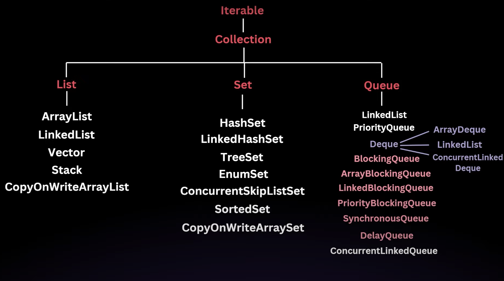

# What is a Collection?

A **collection** is an object that represents a group of objects, referred to as its **elements**.

### Before Collection Framework (JDK 1.2)

Java relied on classes like `Vector`, `Stack`, `Hashtable`, and arrays to store and manipulate groups of objects. However, these approaches had several **drawbacks**:

- **Inconsistency**: Each class had its own way of managing collections, leading to confusion and a steep learning curve.
- **Lack of Inter-operability**: These classes were not designed to work together seamlessly.
- **No Common Interface**: There was no unified interface, making it impossible to write generic algorithms for different types of collections.

### Introduction of the Collection Framework

To address these issues, Java introduced the **Collection Framework** in JDK 1.2.

## Features

- **Unified Architecture**: A consistent set of interfaces for all collections.
- **Inter-operability**: Collections can be easily interchanged and manipulated in a uniform way.
- **Reusability**: Generic algorithms can be written that work with any collection.
- **Efficiency**: The framework provides efficient algorithms for basic operations like searching, sorting, and manipulation.

> The collection framework is primarily built around a set of `interfaces`. Important ones are:

- **Collection**: The root interface for all the other collection types.
- **List**: An ordered collection that can contain duplicate elements (e.g., `ArrayList`, `LinkedList`).
- **Set**: A collection that cannot contain duplicate elements (e.g., `HashSet`, `TreeSet`).
- **Queue**: A collection designed for holding elements prior to processing (e.g., `PriorityQueue`, `LinkedList` when used as a queue).
- **Deque**: A double-ended queue that allows insertion and removal from both ends (e.g., `ArrayDeque`).
- **Map**: An interface that represents a collection of key-value pairs (e.g., `HashMap`, `TreeMap`).

### Implementation of Interfaces

These interfaces are implemented by various classes. For example:

- `ArrayList` and `LinkedList` implement the `List` interface.
- `HashSet` and `TreeSet` implement the `Set` interface.

## Collection Hierarchy



> **Note**: `Map` is a separate interface aside from this, which has classes like `HashMap` and `SortedMap` underneath its hierarchy.

## Collection Interface Overview

- The `Collection` interface is the root interface of the Java Collection Framework. It is the most basic interface that defines a group of objects known as elements. The `Collection` interface is a part of the `java.util` package, and it is a parent interface that is extended by other collection interfaces like `List`, `Set`, and `Queue`.

- Since `Collection` is an interface, it cannot be instantiated directly; rather, it provides a blueprint for the basic operations that are common to all collections.

- The `Collection` interface defines a set of core methods that are implemented by all classes that implement the interface. These methods allow for basic operations such as adding, removing, and checking the existence of elements in a collection.

> The collection interface have some functions  like 
```java
int size();
boolean isEmpty();
boolean contains(Object o);
boolean add(Object o);
boolean remove(Object o);
```
### What is the Iterable Interface?

The `Iterable` interface signifies that if we implement this into a class, then we can iterate through it using a `for` loop or a `while` loop.